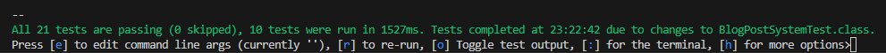

<a name="readme-top"></a>


<h1 align="center">Blog REST Service Project</h1>

Simple REST Service application.

This project is intended to implement the contents of the course IN306 "Verteilte Systeme".


## Prerequisites

#### Following extensions are needed in VS Code

*  [VS Code Extension Pack for Java](https://marketplace.visualstudio.com/items?itemName=vscjava.vscode-java-pack)

*  [VS Code Quarkus Extension](https://marketplace.visualstudio.com/items?itemName=redhat.vscode-quarkus)

#### Additional tools

*  [Docker](https://www.docker.com/products/docker-desktop/) Because nothing runs without Docker :)

#### HTTP Client CLI or GUI like HTTPie, Postman or Bruno

* [HTTPie Desktop](https://httpie.io/download) / [HTTPie CLI](https://httpie.io/docs/cli/installation)

* [Postman](https://www.postman.com/) / [Postman CLI](https://learning.postman.com/docs/postman-cli/postman-cli-installation/)

* [Bruno Desktop](https://www.usebruno.com/downloads) / [Bruno CLI](https://docs.usebruno.com/bru-cli/overview) `Recommendation because the tool is named after their dog`

## Run the App

1. Start Docker

2. Just type following command in your VS Code Terminal:

```sh
.\mnvw quarkus:dev
```

## Run Quarkus Tests

The Quarkus unit and integration tests require the project running with all containers including keycloak.

While running, you can press 'o' to toggle the test output and then re-run tests as you like. In this mode, every time you save changes, the tests are automatically re-run.



## API Documentation

When the project is running, the documentation can be seen via the  Swagger UI: http://localhost:8080/q/swagger-ui/<br>
Default Content-Type: <b>application/json</b> (consumes and produces)<br>
For all POST, PATCH and DELETE requests you will need an access token. When running the project, a keycloak instance will be started automatically via devservices on port 8088.<br>

* **Get the token for the demo user "alice" (roles: admin, user):**

    Command Prompt:
    ```sh
    curl -L -X POST 'http://localhost:8088/realms/blog/protocol/openid-connect/token' --data-urlencode 'client_id=backend-service' --data-urlencode 'client_secret=8H8aGvxocW0kP4ht3kg7dQ8kxHUBr8c8' --data-urlencode 'grant_type=password' --data-urlencode 'username=alice' --data-urlencode 'password=alice'
    ```

    Or using HTTPie:
    ```sh
    http -v --form --auth backend-service:8H8aGvxocW0kP4ht3kg7dQ8kxHUBr8c8 POST http://localhost:8088/realms/blog/protocol/openid-connect/token username=alice password=alice grant_type=password
    ```

<br>

* **Get the token for the demo user "bob" (roles: user):**

    ```sh
    curl -L -X POST 'http://localhost:8088/realms/blog/protocol/openid-connect/token' --data-urlencode 'client_id=backend-service' --data-urlencode 'client_secret=8H8aGvxocW0kP4ht3kg7dQ8kxHUBr8c8' --data-urlencode 'grant_type=password' --data-urlencode 'username=bob' --data-urlencode 'password=bobs_password'
    ```

    Or using HTTPie:
    ```sh
    http -v --form --auth backend-service:8H8aGvxocW0kP4ht3kg7dQ8kxHUBr8c8 POST http://localhost:8088/realms/blog/protocol/openid-connect/token username=bob password=bobs_password grant_type=password
    ```

<!-- When the project is running, the documentation can be seen via the [Swagger UI](http://localhost:8080/q/swagger-ui/) -->

<!------------------------------------------------------------------------------------------------------------------>

---

## Available endpoints

<details>
<summary><b>Get all blog posts</b></summary>

* **Type:** GET
* **Path:** host:port/blogs
* **Constraints:** none
* **Response types:** `200 OK` `404 NOT FOUND` `500 ERROR`
* **Example response body:**
    ```json
    [
        {
            "id": 1,
            "title": "Blog post title",
            "content": "Awesome content",
            "author": "Spongebob Squarepants",
            "createdAt": "2022-03-10T16:15:50Z",
            "lastEditedAt": "2022-03-10T16:15:50Z",
            "comments": [
            {
                "id": 1,
                "blogId": 1,
                "commentNumber": 1,
                "content": "You live in an ananas...",
                "author": "Patrick Star",
                "createdAt": "2022-03-10T16:15:50Z",
                "lastEditedAt": "2022-03-10T16:15:50Z"
            }
            ]
        }
    ]
    ```

* **Request with HTTPie CLI:**
    ```sh
    http -v GET :8080/blogs
    ```

    **Using a filter:**
    ```sh
    http -v GET :8080/blogs searchString=="your search string"
    ```
</details>

<!------------------------------------------------------------------------------------------------------------------>

<details>
<summary><b>Save new blog post</b></summary>

* **Type:** POST
* **Path:** host:port/blogs
* **Constraints:** Authenticated, user role
* **Response types:** `201 CREATED` `401 NOT AUTHORIZED` `403 NOT ALLOWED` `409 CONFLICT` `500 ERROR`
* **Example request body:**
    Note that only the title and content has to be submitted. The rest is generated automatically.
    ```json
    {
        "title": "Super blog title",
        "content": "Even better content"
    }
    ```

* **Example response body:**
    ```json
    {
        "id": 1,
        "title": "Blog post title",
        "content": "Awesome content",
        "author": "Spongebob Squarepants",
        "createdAt": "2022-03-10T16:15:50Z",
        "lastEditedAt": null,
        "comments": null
    }
    ```

* **Request with HTTPie CLI:**
    ```sh
    http -v POST :8080/blogs title="Your Blogtitle" content="Your Blogcontent" 'Authorization: Bearer {token}'
    ```
</details>

<!------------------------------------------------------------------------------------------------------------------>

<details>
<summary><b>Delete all blog posts</b></summary>

* **Type:** DELETE
* **Path:** host:port/blogs
* **Constraints:** Authenticated, admin role
* **Response types:** `204 NO CONTENT` `401 NOT AUTHORIZED` `403 NOT ALLOWED` `500 ERROR`

* **Request with HTTPie CLI:**
    ```sh
    http -v DELETE :8080/blogs 'Authorization: Bearer {token}'
    ```
</details>

<!------------------------------------------------------------------------------------------------------------------>

<details>
<summary><b>Update a blog post</b></summary>

* **Type:** PATCH
* **Path:** host:port/blogs
* **Constraints:** Authenticated, user role
* **Response types:** `200 OK` `401 NOT AUTHORIZED` `403 NOT ALLOWED` `404 NOT FOUND` `500 ERROR`
* **Example request body:**
    ```json
    {
        "id": 1,
        "title": "My first blog post",
        "content": "This is my first updated blog post.",
        "createdAt": "2024-08-25T15:18:29.610083Z",
        "lastEditedAt": null,
        "comments": null
    }
    ```

* **Example response body:**
    ```json
    {
        "id": 1,
        "title": "Updated blog title",
        "content": "Updated blog content",
        "createdAt": "2024-08-25T15:18:29.610083Z",
        "lastEditedAt": "2024-08-25T15:18:29.610083Z",
        "comments": null
    }
    ```

* **Request with HTTPie CLI:**
    ```sh
    http -v PATCH :8080/blogs id=1 title="Updated blog title" content="Updated blog content" 'Authorization: Bearer {token}'
    ```
</details>

<!------------------------------------------------------------------------------------------------------------------>

<details>
<summary><b>Get a blog post by id</b></summary>

* **Type:** GET
* **Path:** host:port/blogs/{blogId}
* **Constraints:** none
* **Response types:** `200 OK` `404 NOT FOUND` `500 ERROR`
* **Example response body:**
    ```json
    {
        "id": 1,
        "title": "Blog title",
        "content": "Blog content",
        "createdAt": "2024-08-25T15:18:29.610083Z",
        "lastEditedAt": "2024-08-25T15:18:29.610083Z",
        "comments": null
    }
    ```

* **Request with HTTPie CLI:**
    ```sh
    http -v GET :8080/blogs/1
    ```
</details>

<!------------------------------------------------------------------------------------------------------------------>

<details>
<summary><b>Delete a blog post by id</b></summary>

* **Type:** DELETE
* **Path:** host:port/blogs/{blogId}
* **Constraints:** Authenticated, user role
* **Response types:** `204 NO CONTENT` `401 NOT AUTHORIZED` `403 NOT ALLOWED` `404 NOT FOUND` `500 ERROR`
* **Request with HTTPie CLI:**
    ```sh
    http -v DELETE :8080/blogs/1 'Authorization: Bearer {token}'
    ```
</details>

<!------------------------------------------------------------------------------------------------------------------>

<details>
<summary><b>Get all comments of a blog post</b></summary>

* **Type:** GET
* **Path:** host:port/blogs/{blogId}/comments
* **Constraints:** none
* **Response types:** `200 OK` `404 NOT FOUND` `500 ERROR`
* **Example response body:**
    ```json
    [
        {
            "id": 1,
            "blogId": 1,
            "commentNumber": 1,
            "content": "This is a nonsense comment",
            "author": "Sheldon Plankton",
            "createdAt": "2022-03-10T16:15:50Z",
            "lastEditedAt": "2022-03-10T16:15:50Z"
        }
    ]
    ```

* **Request with HTTPie CLI:**
    ```sh
    http -v GET :8080/blogs/1/comments
    ```
</details>

<!------------------------------------------------------------------------------------------------------------------>

<details>
<summary><b>Add a new comment to a blog post</b></summary>

* **Type:** POST
* **Path:** host:port/blogs/{blogId}/comments
* **Constraints:** Authenticated, user role
* **Response types:** `201 CREATED` `401 NOT AUTHORIZED` `403 NOT ALLOWED` `409 CONFLICT` `500 ERROR`
* **Example request body:**
    Note that only the content has to be submitted. The rest is generated automatically.
    ```json
    {
        "content": "This is an example comment."
    }
    ```

* **Example response body:**
    ```json
    {
        "id": 1,
        "blogId": 1,
        "commentNumber": 1,
        "content": "This is an example comment.",
        "createdAt": "2024-08-25T15:18:29.610083Z",
        "lastEditedAt": null
    }
    ```

* **Request with HTTPie CLI:**
    ```sh
    http -v POST :8080/blogs/1/comments content="Your Blogcontent" 'Authorization: Bearer {token}'
    ```
</details>

<!------------------------------------------------------------------------------------------------------------------>

<details>
<summary><b>Update a comment from a blog post</b></summary>

* **Type:** PATCH
* **Path:** host:port/blogs/{blogId}/comments
* **Constraints:** Authenticated, user role
* **Response types:** `200 OK` `401 NOT AUTHORIZED` `403 NOT ALLOWED` `404 NOT FOUND` `500 ERROR`
* **Example request body:**
    ```json
    {
        "id": 1,
        "blogId": 1,
        "commentNumber": 1,
        "content": "This is an example comment.",
        "createdAt": "2024-08-25T15:18:29.610083Z",
        "lastEditedAt": null
    }
    ```

* **Example response body:**
    ```json
    {
        "id": 1,
        "blogId": 1,
        "commentNumber": 1,
        "content": "Updated comment example.",
        "createdAt": "2024-08-25T15:18:29.610083Z",
        "lastEditedAt": "2024-08-25T15:18:29.610083Z"
    }
    ```

* **Request with HTTPie CLI:**
    ```sh
    http -v PATCH :8080/blogs/1/comments id=1 content="Updated comment example." 'Authorization: Bearer {token}'
    ```
</details>

<!------------------------------------------------------------------------------------------------------------------>

<details>
<summary><b>Get a comment from a blog post by comment id</b></summary>

* **Type:** GET
* **Path:** host:port/blogs/{blogId}/comments/{commentId}
* **Constraints:** none
* **Response types:** `200 OK` `404 NOT FOUND` `500 ERROR`
* **Example response body:**
    ```json
    {
        "id": 1,
        "blogId": 1,
        "commentNumber": 1,
        "content": "This is an example comment.",
        "createdAt": "2024-08-25T15:18:29.610083Z",
        "lastEditedAt": null
    }
    ```

* **Request with HTTPie CLI:**
    ```sh
    http -v GET :8080/blogs/1/comments/1
    ```
</details>

<!------------------------------------------------------------------------------------------------------------------>

<details>
<summary><b>Delete a comment from a blog post by comment id</b></summary>

* **Type:** DELETE
* **Path:** host:port/blogs/{blogId}/comments/{commentId}
* **Constraints:** Authenticated, user role
* **Response types:** `204 NO CONTENT` `401 NOT AUTHORIZED` `403 NOT ALLOWED` `404 NOT FOUND` `500 ERROR`
* **Request with HTTPie CLI:**
    ```sh
    http -v DELETE :8080/blogs/1/comments/1 'Authorization: Bearer {token}'
    ```
</details>

<!------------------------------------------------------------------------------------------------------------------>

<details>
<summary><b>Get all comments</b></summary>

* **Type:** GET
* **Path:** host:port/comments
* **Constraints:** none
* **Response types:** `200 OK` `404 NOT FOUND` `500 ERROR`
* **Example response body:**
    ```json
    [
        {
            "id": 1,
            "blogId": 1,
            "commentNumber": 1,
            "content": "This is an example comment.",
            "createdAt": "2024-08-25T15:18:29.610083Z",
            "lastEditedAt": null
        }
    ]
    ```

* **Request with HTTPie CLI:**
    ```sh
    http -v GET :8080/comments
    ```

    **Using a filter:**
    ```sh
    http -v GET :8080/comments searchString=="your search string"
    ```
</details>

<!------------------------------------------------------------------------------------------------------------------>

---

#### Getting error responses

Nobody is perfect and sometimes a wild error appears!
Lucky that we are not getting an empty error response :)

Example error response body:
```json
{
    "traceId": "3fa85f64-5717-4562-b3fc-2c963f66afa6",
    "error": "Error name",
    "message:": "Problem description"
}
```

<!------------------------------------------------------------------------------------------------------------------>

---

## Change Log

* [x] Initial commit with demo code
* [x] Updated readme
* [x] Added Lombok support
* [x] Added DependencyInjection support
* [x] Added Hibernate ORM with Panache Qurakus Extension for DB Connectivity and easier DB handling
* [x] Added JDBC Driver for MySQL Quarkus Extension
* [x] Implemented GET, POST, PATCH and DELETE Requests
* [x] Implemented open id connect authentication by jwt
* [x] Implemented unit and integration tests
* [x] Implemented tests with and without authorization

## Roadmap

* [ ] Put all opening curly braces on new line (a hard one)
* [ ] Implement user accounts corresponding to keycloak accounts OR connect keycloak accounts

<!------------------------------------------------------------------------------------------------------------------>

<p align="right">(<a href="#readme-top">back to top</a>)</p>