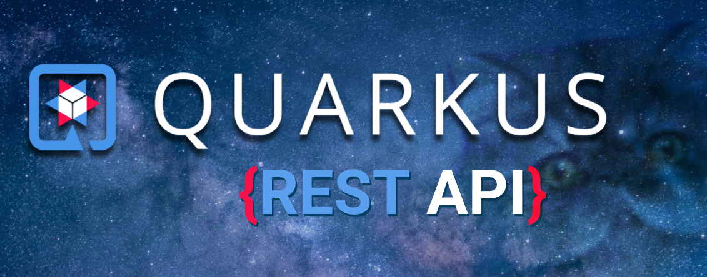

<a name="readme-top"></a>



# Blog REST Service Project

Simple REST Service application.

This project is intended to implement the contents of the course IN306 "Verteilte Systeme".


### Prerequisites

Following extensions are needed in VS Code:
*  [Extension Pack for Java](https://marketplace.visualstudio.com/items?itemName=vscjava.vscode-java-pack)

*  [Quarkus](https://marketplace.visualstudio.com/items?itemName=redhat.vscode-quarkus)


### Run the App

Just type following command in your VS Code Terminal:

```sh
./mnvw quarkus:dev
```

### Run Tests

Run all tests:
```sh
./mvnw test
```

Clean build and run all tests:
```sh
./mvnw clean test
```

## Change Log

- [x] Initial commit with demo code
- [x] Updated readme
- [x] Added Lombok support
- [x] Added DependencyInjection support
- [x] Added Hibernate ORM with Panache Qurakus Extension for DB Connectivity and easier DB handling
- [x] Added JDBC Driver for MySQL Quarkus Extension
- [x] Implemented Repository Pattern

## Roadmap

- [ ] Put all opening curly braces on new line

Roadmap to be completed soon...