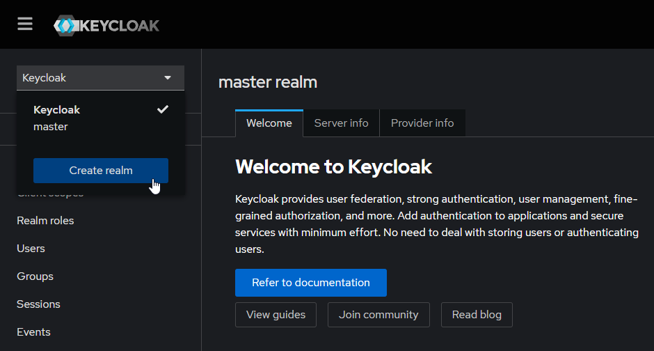
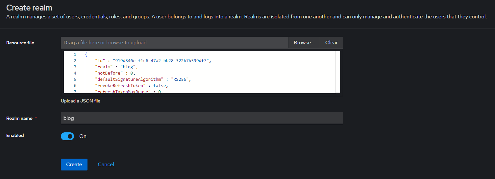

### [◄ Go back to the Readme](../README.md)

# Run the App

No matter if you are running the project on dev profile or production profile, make sure Docker is running.

## a) Dev-Profile

Type following command in your VS Code Terminal:

```sh
./mnvw quarkus:dev
```

What happens:

The application-dev.properties file is loaded. The application is starting with all dev-services which means following containers are started automatically:
- Keycloak instance available on http://localhost:8088/
- Non-persistant mysql database for the Quarkus-Server
- Testcontainers to run unit and integration tests
- The Quarkus-Server available on http://localhost:8080/ (base url for the endpoints)
- Dev-UI available on http://localhost:8080/

Note:
The services take a while until fully started and available.

## b) Production-Profile

Starting the application with production profile requires a few steps more than the dev profile. Future runs with production profile will happen via a docker compose file.

The best way is to directly use the terminal in your Docker Desktop App. Lets get started:

1. **Create the Quarkus image**

    The project is configured to get the application-prod.properties and automatically create a docker image. To create the image we only have to tell maven to package the project by executing following command in the IDE terminal:

    ```sh
    ./mvnw package
    ```    

2. **Create a docker network (otherwise the containers dont see each other and guess what. right, thats not what we want)**

    ```sh
    docker network create blog-nw
    ```

3. **Run (persistent) database containers**

    Keycloak DB:
    ```sh
    docker run --name keycloak-mysql --network blog-nw -v keycloak-db:/var/lib/mysql -p 3306:3306 -e MYSQL_ROOT_PASSWORD=vs4tw -e MYSQL_USER=dbuser -e MYSQL_PASSWORD=dbuser -e MYSQL_DATABASE=keycloakdb -d mysql:8.0
    ```

    Blog API  DB:
    ```sh
    docker run --name blog-mysql --network blog-nw -v blog-db:/var/lib/mysql -p 3406:3306 -e MYSQL_ROOT_PASSWORD=vs4tw -e MYSQL_USER=dbuser -e MYSQL_PASSWORD=dbuser -e MYSQL_DATABASE=blogdb -d mysql:8.0
    ```

4. **Run keycloak image**

    ```sh
    docker run --name keycloak --network blog-nw -e KEYCLOAK_ADMIN=admin -e KEYCLOAK_ADMIN_PASSWORD=admin -e KC_HTTP_PORT=8180 -e KC_HOSTNAME_URL=http://keycloak:8180 -p 8180:8180 -e KC_DB=mysql -e KC_DB_URL=jdbc:mysql://keycloak-mysql:3306/keycloakdb -e KC_DB_USERNAME=dbuser -e KC_DB_PASSWORD=dbuser -d quay.io/keycloak/keycloak:25.0.2 start-dev
    ```

5. **Load a keycloak configuration json**

    Since the automatic import didnt work, we have to do it by hand. Yay actually some work. Wait until the keycloak instance is fully started. Then access it via http://keycloak:8180/ and login: `username: admin, password: admin`.
    <br>
    <br>

    Once logged in, select the dropdown and click "Create realm".

    

    <br>

    Click on "Browse..." and go for the blog-realm.json in the project directory. The file should be loaded and the realm name set accordingly. Finish the import by clicking "Create".

    

    The keycloak instance now has imported the realm configuration and persisted it to the database.
    
    <br>


6. **Run Quarkus image**

    We have generated the image in the IDE, so Docker already knows whats going on. We can start the image just by executing following command:

    ```sh
    docker run --name blog_api_service --network blog-nw -p 9090:8080 andre/ch.hftm/blog-rest-service:1.0.0-SNAPSHOT
    ```