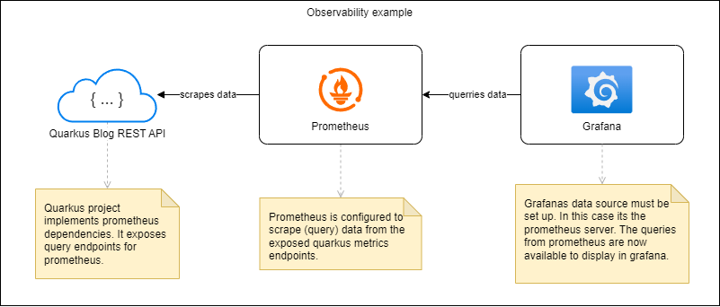
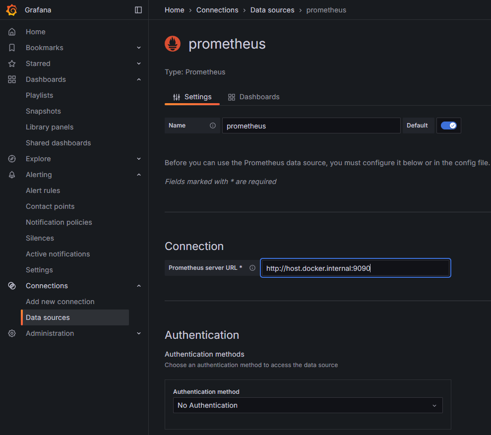
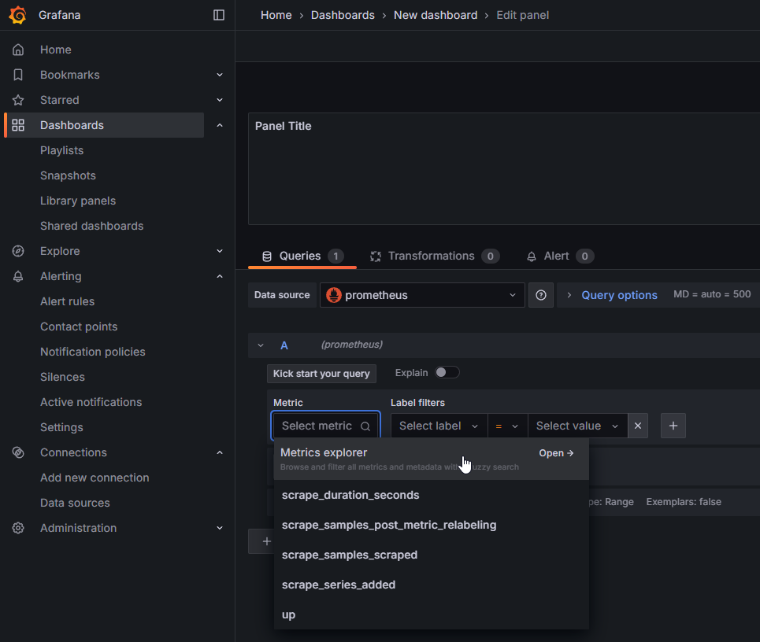

### [◄ Go back to the Readme](../README.md)

# Run the project with observability tools

## Overview

The graphics below shows a simple example how observability in this project is set up:




Currently the app only runs with observability tools in dev mode.

Following steps must be followed to get some output in grafana:

## 1. Start prometheus container

The prometheus container needs an initial configuration (found in project /config). Adjust the path in the command below.

```sh
docker run -d --name prometheus-dev -p 9090:9090 -v C:/your/path/to/prometheus.yaml:/etc/prometheus/prometheus.yaml prom/prometheus --config.file=/etc/prometheus/prometheus.yaml
```

## 2. Start grafana container

The prometheus container needs an initial configuration (found in project /config). Adjust the path in the command below.

```sh
docker run -d --name grafana-dev -p 3000:3000 grafana/grafana
```

## 3. Start project in dev mode

```sh
./mvnw quarkus:dev
```

# 4. Set up grafana

Go to localhost:3000 and the grafana ui will show up. Login with initial default username 'admin' and password 'admin'.

Click 'Data Sources' and select Prometheus. Now you should see the page below. Type in the connection and save.



# 5 Create a dashboard

Go to 'Dashboards' and select 'New'. Then select the data source (prometheus) and then 'Add Visualization'.

From here you can select metrics, endpoints, labels etc. Just try some metrics from the 'Metrics Explorer'.

