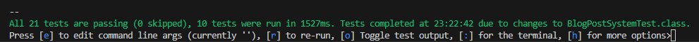

### [◄ Go back to the Readme](../README.md)

# Run unit and integration tests

Coming soon... who wants to test anyway

<!-- The Quarkus unit and integration tests require the project running with all containers including keycloak.

While running, you can press 'o' to toggle the test output and then re-run tests as you like. In this mode, every time you save changes, the tests are automatically re-run.

 -->